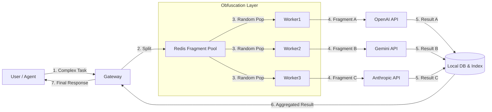

# ShadowMixer — 开发者的大模型隐私混淆与聚合引擎

**ShadowMixer** 是一个开源的后端组件，旨在通过**碎片化混淆（Fragmented Obfuscation）**技术，将 OpenAI、Anthropic、Gemini 等大模型厂商降级为单纯的“算力提供商”，从而彻底保护用户隐私与意图。

它的核心理念是将用户的完整请求（Context）在本地进行**语义拆解**，打散成无上下文关联的独立碎片（Fragments），混入高并发的公共请求池中，经由不同的 API Key 和 IP 随机调用，最后在本地数据库中重新**索引聚合**。

对大模型厂商而言，它们只能看到无数毫无关联的句子或段落，无法拼凑出用户的真实意图。

## 核心工作流
1. **分解（Decompose）**：
   - 接收用户或 Skill Agent 的复杂指令。
   - 自动拆解为 $N$ 个独立的原子任务（Fragments）。
   - *示例：将一篇长文翻译任务拆解为 50 个独立的句子翻译任务。*

2. **混淆（Shuffle & Jitter）**：
   - 将所有用户的 Fragments 放入全局队列池。
   - 引入随机延迟（Jitter）和顺序打乱。
   - 利用多用户并发流量，掩盖单个用户的时序特征。

3. **算力路由（Compute Routing）**：
   - Worker 从池中随机捞取 Fragment。
   - 轮询使用不同的 API Key（Key Pooling）请求上游模型。
   - 上游模型仅作为“文本处理器”运行，无法获取完整 Context。

4. **重组（Reassemble）**：
   - 结果存入本地数据库（Redis/SQLite），建立索引。
   - 聚合器（Aggregator）根据 TaskID 和 SequenceID 拉取所有碎片。
   - 按正确顺序拼装结果，返回给用户或下游应用。

## 适用场景
- **企业级隐私网关**：防止员工在使用 AI 时泄露核心代码或商业机密。
- **敏感数据处理**：医疗、法律文档的脱敏处理与分段润色。
- **去中心化 AI 代理**：作为 Agent 的底层通信层，保障 Agent 思考过程的隐私。

## 架构图


## 快速开始

### 1. 启动服务
```bash
# 启动 Redis 和 ShadowMixer
docker-compose up --build
```

### 2. 配置 (`config.yaml`)
```yaml
llm:
  api_keys: ["sk-key-1", "sk-key-2"] # 多个 Key 轮询
  target: "https://api.openai.com/v1/chat/completions"
```

### 3. 调用示例
向 ShadowMixer 发送一个需要拆解的长任务：

```bash
curl -X POST http://localhost:8080/v1/secure/chat \
  -H "Content-Type: application/json" \
  -d '{
    "model": "gpt-3.5-turbo",
    "messages": [
        {"role": "user", "content": "请帮我翻译以下三段话：\n1. Apple is a fruit.\n2. Sky is blue.\n3. Coding is fun."}
    ],
    "strategy": "split_by_line" 
  }'
```
ShadowMixer 会将其拆分为 3 个独立请求，分别调用上游，最后合并返回：
```json
{
  "id": "task-12345",
  "status": "completed",
  "content": "1. 苹果是一种水果。\n2. 天空是蓝色的。\n3. 编程很有趣。"
}
```

## 许可证
MIT License
